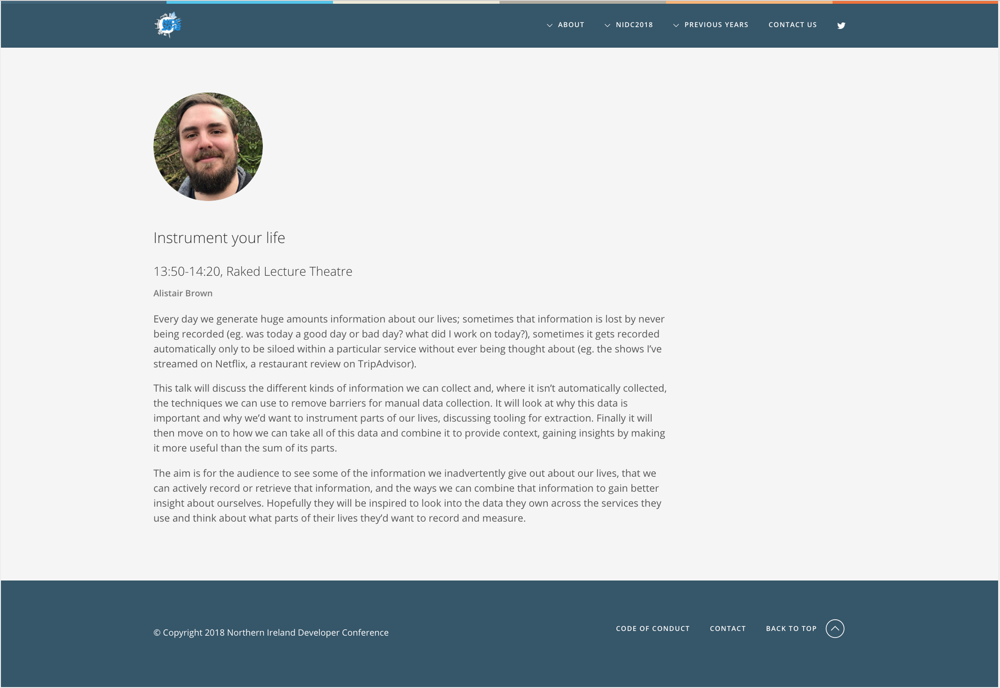
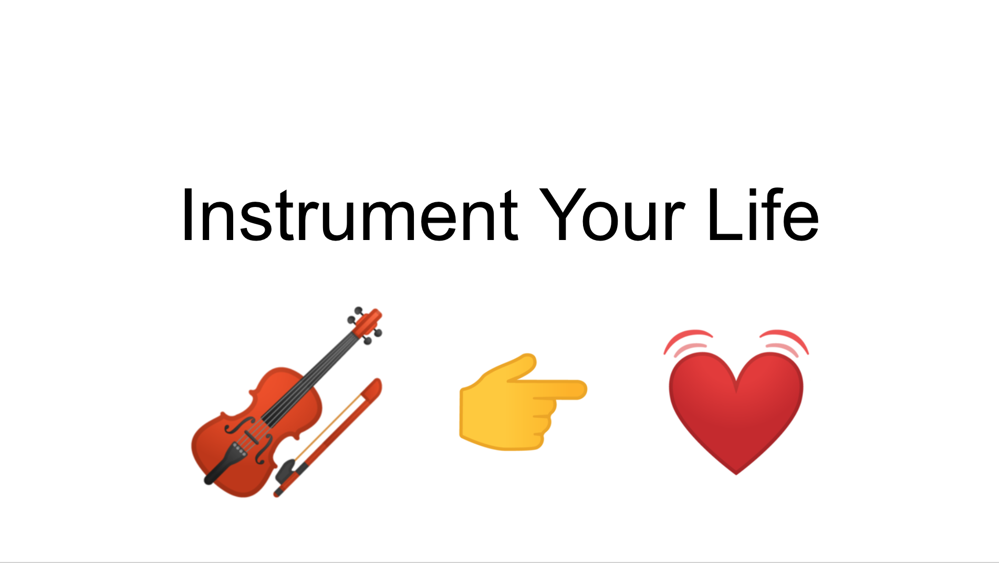

# NI Dev Conf 2018

Northern Ireland Developer Conference 2018

 - __Date:__ June 9th 2018
 - __Location:__ Riddel Hall, Queen's University Belfast
 - 13:50 - 14:20, Raked Lecture Theatre

## Instrument Your Life

https://www.nidevconf.com/sessions/alistairbrown/

Archive: https://2018.nidevconf.com/sessions/alistairbrown/

Every day we generate huge amounts information about our lives; sometimes that information is lost by never being recorded (eg. was today a good day or bad day? what did I work on today?), sometimes it gets recorded automatically only to be siloed within a particular service without ever being thought about (eg. the shows I’ve streamed on Netflix, a restaurant review on TripAdvisor).

This talk will discuss the different kinds of information we can collect and, where it isn’t automatically collected, the techniques we can use to remove barriers for manual data collection. It will look at why this data is important and why we’d want to instrument parts of our lives, discussing tooling for extraction. Finally it will then move on to how we can take all of this data and combine it to provide context, gaining insights by making it more useful than the sum of its parts.

The aim is for the audience to see some of the information we inadvertently give out about our lives, that we can actively record or retrieve that information, and the ways we can combine that information to gain better insight about ourselves. Hopefully they will be inspired to look into the data they own across the services they use and think about what parts of their lives they’d want to record and measure.

## Video

Click to watch the video on YouTube

- YouTube: https://www.youtube.com/watch?v=LAH0oqcCfGM
- MP4 export - [Download](./insrument-your-life.mp4)

## Slides

Click to view embedded presentation in your browser

 - Google Slides: https://docs.google.com/presentation/d/15lDsKfXd1eAC6Tbdg6DNJZGOkZNPN6ImyAKQ194GGqo/edit?usp=sharing
 - PDF export - [Download](./insrument-your-life.png)
 - Powerpoint export - [Download](./insrument-your-life.pptx)
 - ODP export - [Download](./insrument-your-life.odp)
